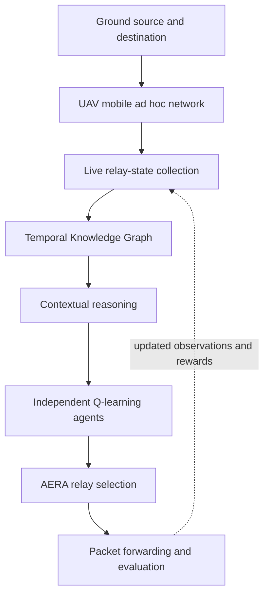
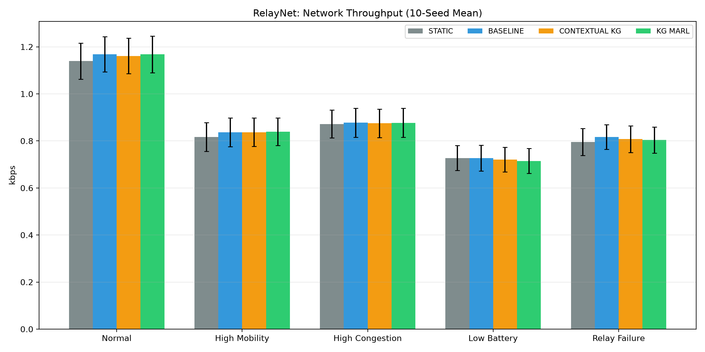

# RelayNet

### Adaptive Emergency Mesh Routing Protocol for Infrastructure-less Disaster Communication

[](https://www.python.org/)
[](#current-scope-and-roadmap)
[](#evaluation)

RelayNet is a simulation-based disaster communication system in which nearby
devices and UAVs form an emergency mobile ad hoc network when cellular towers,
the Internet, or other fixed infrastructure are unavailable.

The prototype implements the **Adaptive Emergency Mesh Routing Protocol
(AEMRP)**. Its **Adaptive Emergency Relay Algorithm (AERA)** combines live
network state, explainable Knowledge Graph (KG) reasoning, and lightweight
multi-agent reinforcement learning (MARL) to select a suitable relay as
conditions change.

> **Project status:** the proposed information flow is implemented and tested
> in a custom Python simulator. Physical devices, real UAVs, NS-3, and deep
> MARL are future extensions—not features of the current prototype.

## Why RelayNet?

Traditional shortest-path or fixed routing decisions can become unreliable in
a disaster network because relays move, batteries drain, queues fill, links
degrade, and nodes may fail. RelayNet makes the routing decision using the
relay's current context and its learned delivery experience instead of using
hop count alone.

## System terminology

| Term | Meaning |
|---|---|
| **RelayNet** | The complete infrastructure-less disaster communication system |
| **AEMRP** | The proposed adaptive routing protocol used by RelayNet |
| **AERA** | The relay-selection algorithm inside AEMRP |
| **Knowledge Graph** | A temporal, CSV-backed graph of relay observations and derived context |
| **MARL** | Independent tabular Q-learning, with one Q-table for each UAV relay |

## Implemented features

- Simulated source, destination, and three UAV relay agents
- Explicit MANET topology with range-based neighbour discovery, dynamic
  wireless links, link costs, and Dijkstra multi-hop route discovery
- Dynamic RSSI, battery, queue length, mobility, link stability, hop count,
  UAV platform, and altitude
- Packet generation, queueing, forwarding, probabilistic delivery, and energy
  consumption
- Temporal subject-predicate-object Knowledge Graph exported to CSV
- Temporal KG simulation graph at T0, T5, and T10
- Explainable relay recommendations: `PREFER`, `CAUTION`, and `AVOID`
- Human-readable reasons such as low battery, high congestion, weak RSSI, or
  poor link stability
- Independent Q-learning agents with KG-assisted relay selection
- Exported RL hyperparameters and per-episode learning metrics
- Five disaster-network scenarios and four routing strategies
- Single-seed and ten-seed evaluations with CSV results and comparison charts

## Architecture



### Relay-selection flow

1. The simulator updates each relay's mobility, RSSI, battery, queue, and link
   stability.
2. The same state schema is represented in the temporal Knowledge Graph.
3. Rule-based reasoning assigns a contextual score, recommendation, and
   explanation to every available relay.
4. Each relay's agent discretizes its state and retrieves a learned Q-value.
5. AERA combines **65% contextual KG score** and **35% normalized learned
   value**. An `AVOID` recommendation receives an additional penalty.
6. The highest-ranked available relay forwards the packet. During training,
   delivery outcome and relay condition update that relay's Q-table.

The weighted baseline uses normalized RSSI, battery, queue availability,
mobility, link stability, and hop count. The KG method changes the emphasis and
adds explicit contextual warnings; the learning method uses delivery feedback
to improve future selections.

## Routing methods compared

| Method | Description |
|---|---|
| `static` | Selects the available relay with the smallest hop count |
| `baseline` | Uses a weighted score over six current network features |
| `contextual_kg` | Applies KG-compatible contextual rules and recommendations |
| `kg_marl` | Combines the contextual KG score with independent Q-learning |

## Scenarios and metrics

The evaluation sends 1,000 packets per run under five conditions:

- `normal`
- `high_mobility`
- `high_congestion`
- `low_battery`
- `relay_failure` (relay R2 fails after time step 500)

Each method is evaluated using packet delivery ratio (PDR), packet loss ratio,
average end-to-end delay, throughput, total UAV energy consumption, and network
lifetime.

## Repository structure

```text
RelayNet/
├── data/
│   └── relaynet_simulation.csv
├── docs/
│   └── evaluation_summary.md
├── python/
│   ├── experiments/          # Scenario, KG, MARL, and multi-seed runs
│   └── relaynet/             # Network, routing, KG, and learning modules
├── results/                  # Generated CSV files, Q-tables, and charts
└── README.md
```

## Installation

### Prerequisites

- Python 3.10 or later
- Git

Clone the repository and enter its root directory:

```bash
git clone https://github.com/ShreyaVispute021/RelayNet.git
cd RelayNet
```

Create a virtual environment and install the plotting/data-analysis packages:

```bash
python -m venv .venv
source .venv/Scripts/activate   # Git Bash on Windows
python -m pip install --upgrade pip
python -m pip install matplotlib pandas
```

On PowerShell, activate the environment with:

```powershell
.\.venv\Scripts\Activate.ps1
```

## Run the project

Run commands from the repository root so Python can resolve the `python`
package correctly.

### Launch the integrated dashboard

Install the dependencies and start the RelayNet Control Center:

```bash
python -m pip install -r requirements.txt
python -m streamlit run dashboard/app.py
```

The dashboard combines scenario controls, MANET topology, KG reasoning,
Q-learning parameters and training progress, multi-seed metrics, downloadable
results, and buttons for running the verified experiment modules.

### Recommended demonstration

```bash
# 1. Generate live relay-state observations
python -m python.experiments.dynamic_scenario

# 2. Demonstrate MANET neighbour discovery and multi-hop routing
python -m python.experiments.manet_simulation

# 3. Construct and export the temporal Knowledge Graph
python -m python.relaynet.knowledge_graph

# 4. Generate the temporal KG simulation graph
python -m python.experiments.visualize_knowledge_graph

# 5. Show contextual recommendations and explanations
python -m python.experiments.kg_contextual_reasoning

# 6. Verify KG-assisted selection against live relay objects
python -m python.experiments.kg_integration_test

# 7. Train agents; export parameters, metrics, Q-tables, and graphs
python -m python.experiments.kg_marl_experiment

# 8. Run the final ten-seed evaluation and generate charts
python -m python.experiments.multi_seed_evaluation
```

For a shorter comparison without agent training:

```bash
python -m python.experiments.contextual_routing_comparison
```

## Evaluation

The final experiment trains independent Q-learning agents for 60 episodes
across all five scenarios, then evaluates every method using ten random seeds
(40–49). This produces 200 evaluation runs:

```text
5 scenarios × 4 routing methods × 10 seeds = 200 runs
```

### Preliminary ten-seed results: high mobility

| Method | Mean PDR | Mean delay | Mean throughput |
|---|---:|---:|---:|
| Static | 19.93% | 9.36 steps | 0.816 kbps |
| Weighted baseline | 20.43% | 18.33 steps | 0.837 kbps |
| Contextual KG | 20.43% | 15.70 steps | 0.837 kbps |
| **KG + MARL** | **20.48%** | 16.59 steps | **0.839 kbps** |

KG + MARL achieves the highest mean PDR and throughput in the high-mobility
scenario. Contextual KG reduces delay relative to the weighted baseline in
several dynamic conditions. The methods remain close overall, and KG + MARL
does **not** dominate every scenario or metric. In particular, low-battery
routing requires stronger lifetime-aware reward shaping.




Full results are available in
[`docs/evaluation_summary.md`](docs/evaluation_summary.md) and the generated
CSV files.

## Generated outputs

| Output | Purpose |
|---|---|
| `data/relaynet_simulation.csv` | Time-varying relay observations |
| `results/manet_routing_log.csv` | Dynamic links, routes, hop counts, and costs |
| `results/manet_topology.png` | MANET snapshots with discovered routes |
| `results/relaynet_knowledge_graph.csv` | Temporal KG triples and derived reasoning |
| `results/kg_simulation_graph.png` | Visual KG snapshots at T0, T5, and T10 |
| `results/marl_q_tables.csv` | Learned per-relay Q-table entries |
| `results/rl_parameters.json` | Exact Q-learning, exploration, and reward parameters |
| `results/rl_training_metrics.csv` | Reward, delivery rate, TD error, epsilon, and table growth |
| `results/rl_training_progress.png` | Four-panel RL learning-progress graph |
| `results/kg_marl_comparison.csv` | Same-seed comparison of all routing methods |
| `results/multi_seed_detailed.csv` | Results for every seed, scenario, and method |
| `results/multi_seed_summary.csv` | Mean and standard deviation for all metrics |
| `results/multi_seed_*.png` | Six ten-seed metric comparison charts |

## Current scope and roadmap

### Completed in the prototype

- End-to-end custom Python network simulation
- Range-based MANET topology and multi-hop route discovery
- Dynamic relay state collection and synthetic dataset generation
- Weighted, contextual KG, and KG + MARL relay selection
- Explainable KG recommendations and temporal triple export
- Scenario-based packet, delay, throughput, energy, and lifetime evaluation
- Reproducible ten-seed comparison and result visualization
- RL hyperparameter, reward, exploration, and learning-metric reporting

### Planned extensions

- Device-to-device socket demonstration for actual message transfer
- NS-3 implementation and comparison with protocols such as AODV and DSR
- Wireshark-based packet validation
- Persistent graph storage using SQLite or Neo4j
- AirSim or physical UAV integration
- Larger and more realistic topologies
- Emergency-priority traffic and explicit historical-success features
- Improved reward shaping and deeper multi-agent algorithms such as MADDPG

## Limitations

RelayNet currently uses synthetic mobility and traffic, a simplified delivery
model, three simulated UAV relays, a CSV-backed graph, and tabular independent
Q-learning. The results establish prototype feasibility and explainable
adaptation; they should not be interpreted as real-world deployment results.

## Project details

- **Team:** MeshMind
- **Developer:** Shreya Ganesh Vispute (24BCE0563)
- **Institution:** Vellore Institute of Technology, Vellore
- **Faculty guide:** Dr. Yoganand S
- **Repository:** [github.com/ShreyaVispute021/RelayNet](https://github.com/ShreyaVispute021/RelayNet)

---

RelayNet is an academic prototype developed to study adaptive and explainable
emergency routing for infrastructure-less disaster communication.
